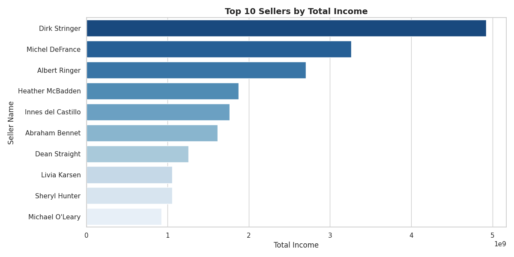
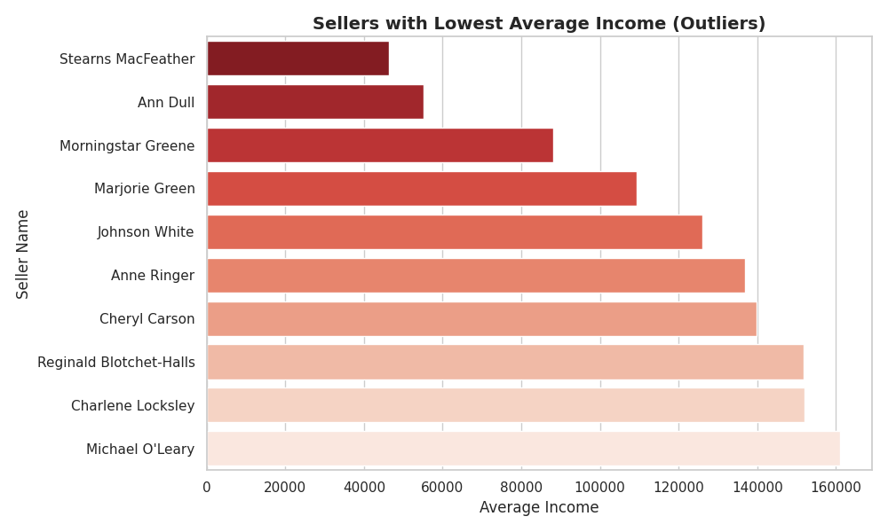
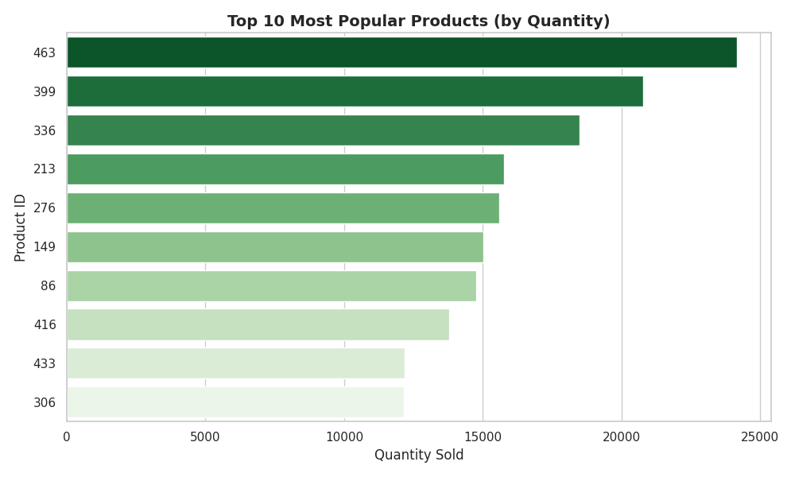
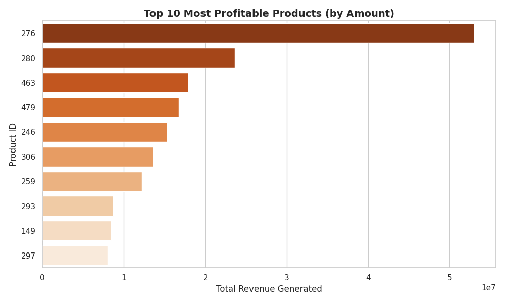
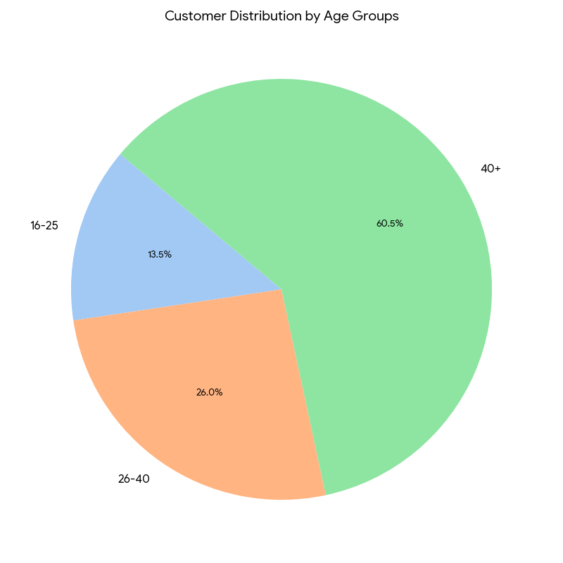
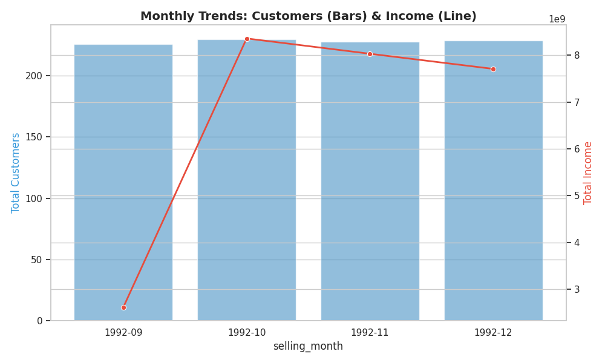
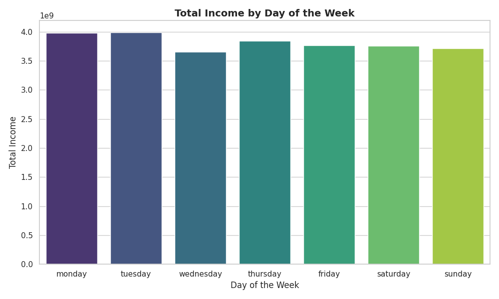

# Retail Sales & Operations Efficiency Audit

**[📁 Download Presentation (pdf)](Retail-Sales-Efficiency-Audit.pdf)**

---

## [EN] Project Overview
**From Raw Data to Growth Strategy:** Comprehensive analysis of a retail network based on a dataset of **20,000+ transactions** and **19,000+ unique customers**. The goal was to identify profit leaks, quantify sales efficiency, and move from intuitive management to an evidence-based approach.

### 🚀 Key Achievements:
* **Seller Performance:** Identified a significant business dependency: the **top 3 sellers** (Dirk Stringer, Michel DeFrance, Albert Ringer) contribute **53.3%** of the total revenue.
* **Product Insights:** Ranked products by volume and profitability; identified Product #463 as the primary traffic driver (**24,175 units**) and Product #276 as the core revenue generator (**~53M**).
* **Customer Demographics:** Segmented the database by age, confirming that **60.5%** of the core revenue is generated by the **40+** category.
* **Seasonality & Trends:** Analyzed a massive revenue spike in **October (8.3B)** and identified **Monday and Tuesday** as peak income days to optimize staffing.

**Stack:** PostgreSQL, Python (Matplotlib/Seaborn).

---

## [RU] Аудит эффективности розничных продаж
**От хаоса в данных к стратегии роста:** Комплексный анализ розничной сети на основе массива из более чем **20 000 транзакций** и **19 000 профилей клиентов**. Цель — оцифровать реальную эффективность продаж, выявить «точки утечки» прибыли и оптимизировать операционные процессы.

### 🚀 Ключевые результаты:
* **Эффективность сотрудников:** Выявлена высокая концентрация капитала: **ТОП-3 продавца** генерируют **53.3% всей выручки** (10.8 млрд из 20.4 млрд).
* **Анализ товаров:** Определены лидеры продаж по количеству (Продукт №463) и прибыльности (Продукт №276) для настройки автоматических воронок допродаж.
* **Демография покупателей:** Сегментация подтвердила, что **60.5%** дохода обеспечивает ядро аудитории в категории **40+**.
* **Тренды и сезонность:** Изучена помесячная динамика выручки (пик в **октябре — 8.3 млрд**) и распределение доходов по дням недели для планирования нагрузки.

**Стек:**PostgreSQL (DBeaver), Python (Pandas, Seaborn).

---

> **Humor:** «Потратила 2 часа на SQL-запрос, чтобы доказать, что Dirk Stringer работает за троих, пока остальные менеджеры просто создают видимость бурной деятельности».

---

### Visual Insights

#### Sales Performance

#### Product & Customer Analysis

#### Trends & Daily Patterns

